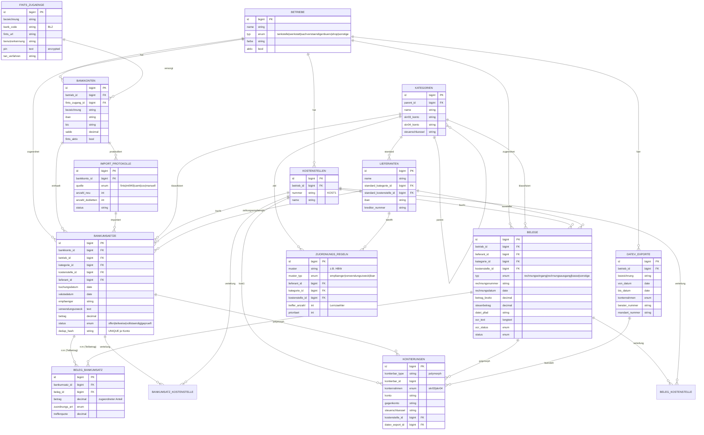

# ER-Diagramm – Digitaler Pendelordner

Entity-Relationship-Modell der Datenbank. Auf GitHub wird das Mermaid-Diagramm
direkt gerendert.

## Beziehungen in Kürze

| Beziehung | Typ | Bedeutung |
|-----------|-----|-----------|
| Bankumsatz ↔ Beleg | n:m (`beleg_bankumsatz`) | Ein Umsatz kann mehrere Belege enthalten; ein Beleg kann auf mehrere Umsätze aufgeteilt werden. Pivot-Feld `betrag` hält den Teilbetrag (Modul 5). |
| FinTS-Zugang → Bankkonten | 1:n | Ein Online-Banking-Login versorgt mehrere Konten. |
| Zuordnungsregel → Lieferant/Kategorie/Kostenstelle | n:1 | Lernfähige Auto-Zuordnung (Modul 4). |
| Kontierung → Bankumsatz/Beleg | polymorph | SKR03/04-Buchungsvorbereitung (Modul 13). |
| Bankumsatz/Beleg ↔ Kostenstelle | n:m (Pivot) | Vorbereitete Mehrfach-Kostenstellen-Verteilung (Modul 9). |
