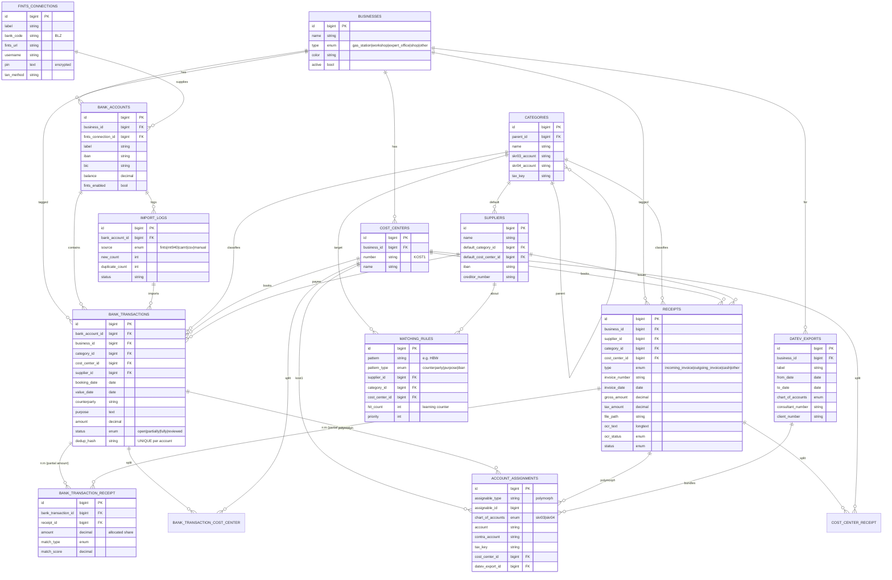

# ER-Diagramm – Digitaler Pendelordner

Entity-Relationship-Modell der Datenbank. Tabellen-/Spaltennamen sind englisch
(Laravel-Standard), die Oberfläche und Kommentare sind deutsch. Auf GitHub wird
das Mermaid-Diagramm direkt gerendert.

## Beziehungen in Kürze

| Beziehung | Typ | Bedeutung |
|-----------|-----|-----------|
| `bank_transactions` ↔ `receipts` | n:m (`bank_transaction_receipt`) | Ein Umsatz kann mehrere Belege enthalten; ein Beleg kann auf mehrere Umsätze aufgeteilt werden. Pivot-Feld `amount` hält den Teilbetrag (Modul 5). |
| `fints_connections` → `bank_accounts` | 1:n | Ein Online-Banking-Login versorgt mehrere Konten. |
| `matching_rules` → supplier/category/cost_center | n:1 | Lernfähige Auto-Zuordnung (Modul 4). |
| `account_assignments` → transaction/receipt | polymorph | SKR03/04-Buchungsvorbereitung (Modul 13). |
| transaction/receipt ↔ `cost_centers` | n:m (Pivot) | Vorbereitete Mehrfach-Kostenstellen-Verteilung (Modul 9). |
